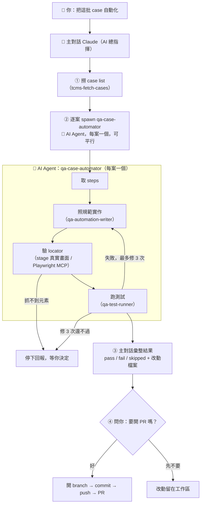

# 如何把 TCMS case 自動化

一句話：**跟 Claude 說要自動化哪些 case，它就會做完給你，最後問你要不要開 PR。**

你不用記指令、不用自己開瀏覽器、不用管它怎麼跑。用講的就好。

> **這是一條 AI Agent 流程**：你對話的**主對話 Claude 是 AI 總指揮**，它會派出 🤖 **AI Agent `qa-case-automator`**（每個 case 一個）去實際做事。全程有 AI 在跑，你負責出需求 + 最後決定要不要開 PR。

---

## 怎麼用（直接把這些話貼給 Claude）

**單一 case**
```
KQT-T37931 實作
```

**一批 case**
```
把 KQT-T37935、KQT-T37938 做成自動化
```

**整個 Run**
```
Run 95 的 case 全部自動化
```
```
Run 95 裡 Eden 的 case 自動化
```

**想加速一批**
```
這批 case 平行處理
```

**做完想追問**
```
為什麼 KQT-T37938 是 skipped？
```

你全程只需要在**最後回答一件事：要不要開 PR**。同意它才會動 git。

---

## 流程圖

你出需求後，主對話當總指揮、逐案分派給工人，最後回來問你要不要開 PR：



### 元件各是什麼

> **型別看這裡**：🤖 **Agent** 是會獨立跑一連串工作的 subagent；📄 **Skill** 只是一份「怎麼做」的規範/腳本，被 Agent 或主對話載來用。這份流程裡**唯一的 Agent 是 `qa-case-automator`**，其餘三個 `tcms-*` / `qa-*` 都是 Skill。

| 元件 | 型別 | 說明 |
| --- | --- | --- |
| **主對話 Claude** | 總指揮 | 你直接對話的那個。負責撈 case、分派、彙整、問你開不開 PR。**只有它能開 PR。** |
| **`qa-case-automator`** | 🤖 **Agent（subagent）** | 一個 case 開一個 agent，做完就結束。不撈整批、不開 PR、不叫別的 agent。 |
| `tcms-fetch-cases` | 📄 Skill | 從 TCMS 撈 case 的 steps。 |
| `qa-automation-writer` | 📄 Skill | 寫 code + 驗 locator 的規範。 |
| `qa-test-runner` | 📄 Skill | 跑測試 + 失敗診斷/修復的規範。 |
| **Playwright MCP** | 工具 | 驗 locator 時開的**真實瀏覽器**，導到 `stage.kkday.com` 比對畫面。**單一共用，不能多案同開。** |
| **kkday-QA-automation** | 本機 repo | 測試碼真正落地的地方（page object / test step / case yaml）。 |

---

## 想加速一批：為什麼不是「全平行」

你可以叫 Claude「平行處理」，但有個先天限制：**驗 locator 那步沒辦法平行**，因為 Playwright MCP 是**單一共用瀏覽器**，多個工人同時開會互相搶頁面。

| 階段 | 能不能平行 |
| --- | --- |
| 撈 case steps | ✅ |
| 寫 code / 改 page object | ✅ |
| **驗 locator（MCP 共用瀏覽器）** | ❌ 單一 session |
| 跑測試（qatest 自帶瀏覽器） | ✅ |

所以 Claude 的加速做法是 **「驗證集中、其餘平行」**：主對話一次把整批要驗的 locator 驗完（能沿用既有 locator 的就不重驗），再把「寫 code + 跑測試」分給多個工人平行。整批時間會下降，但不會線性下降——這是工具限制，不是它偷懶。

---

## 前置條件

- 本機要有 `kkday-QA-automation` clone（沒有的話 Claude 會請你先 clone，不會亂 clone）
- Web / MWeb 需要 Playwright MCP；App 需要對應模擬器 / 裝置
- 預設只做**驗證過的平台**（通常 web）。MWeb / App 畫面結構不同，沒實測過它不會亂猜——要補其他平台請明講。

## 常見坑

- **MCP Playwright 不能平行**：單一共用瀏覽器，驗 locator 集中在主對話做。
- **stage 首頁搜尋框 ≠ landing page 搜尋框**：真實行為以 stage 實測為準，別照 case 字面猜入口（KQT-T37931 踩過）。
- **agent 不開 PR**：刻意的職責邊界，開 PR 永遠回到主對話 + 你確認。

## 想知道更多

背後的職責邊界、禁止事項、底層指令，看 `agents/qa-case-automator.md`（權威定義）。
