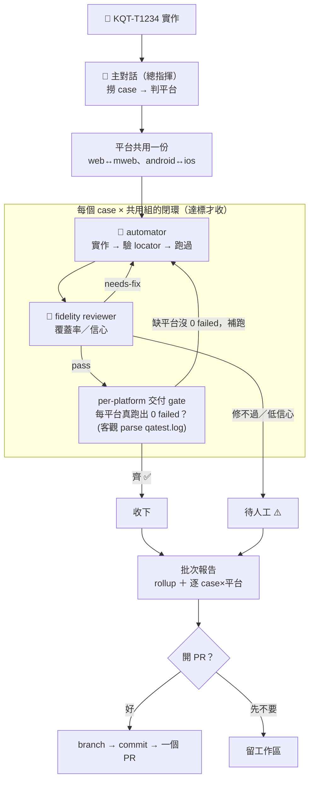

# 如何把 TCMS case 自動化

> **⚠️ 第一次用 / 重裝先看這裡**：這條流程靠 repo 內的 skill / agent / hook，**沒裝好下面都不會動**。先照 [README 的「安裝」段](https://github.com/kkday-it/kkday-qa-skills/blob/master/README.md#安裝) 把 skills、agents 用 **symlink** 裝進 Claude Code（symlink 才會跟著 `git pull` 更新，不像 copy 會變舊）。在本 repo 裡跑時，checked-in 的 `.claude/settings.json`（忠實度硬 gate + 遙測 Stop hook）自動生效、不用另外裝。

一句話：**跟 Claude 說要自動化哪些 case，它就會做完給你，最後問你要不要開 PR。**

你不用記指令、不用自己開瀏覽器、不用管它怎麼跑。用講的就好。

> **這是一條 AI Agent 流程**：你對話的**主對話 Claude 是 AI 總指揮**，它會派兩種 🤖 AI Agent 去做事——`qa-case-automator`（實作）與 `qa-case-fidelity-reviewer`（檢查實作有沒有忠實對到 case）。全程有 AI 在跑，你負責出需求 + 最後決定要不要開 PR。

---

## 怎麼用（直接把這些話貼給 Claude）

**單一 case**
```
KQT-T1234 實作
```

**一批 case**
```
把 KQT-T1234、KQT-T5678 做成自動化
```

**整個 Run**
```
Run 95 的 case 全部自動化
```
```
Run 95 裡 Eden 的 case 自動化
```

**做完想追問**
```
為什麼 KQT-T5678 是 flag-for-human？
```

你全程只需要在**最後回答一件事：要不要開 PR**（過程中若有平台/缺資訊要確認，Claude 也會問你，見下）。

---

## 流程圖（「KQT-T1234 實作」實際會跑的）



重點：**「跑得起來」不等於「過」**。每個 case 實作完會經 `qa-case-fidelity-reviewer` 檢查有沒有忠實覆蓋 case（每個 expected 有沒有真的被斷言）；不夠 → **自動丟回去修再檢查**（最多幾輪），還不行才標「待人工」。

> **過程中遇缺資訊/待確認**（平台選擇、`web/API` 混用、缺 oid…）：**互動模式** → 問你；**自主/harness 模式** → 套安全預設續跑或標 `blocked`（不停等）。這條旁支不畫進主流程，免得線交錯。

### 元件各是什麼

> **型別**：🤖 **Agent** 會獨立跑一連串工作（subagent）；📄 **Skill** 是「怎麼做」的規範，被 Agent/主對話載來用。這流程有**兩個 Agent**：`qa-case-automator`、`qa-case-fidelity-reviewer`。

| 元件 | 型別 | 說明 |
| --- | --- | --- |
| **主對話 Claude** | 總指揮 | 你直接對話的那個。撈 case、判平台、跑「實作→檢查→重修」閉環、彙整報告、問你開不開 PR。**只有它能開 PR、也只有它會問你。** |
| **`qa-case-automator`** | 🤖 Agent | tag 標的平台**共用一份**（web↔mweb 共用、android↔ios 共用，只有些許步驟差異）實作(create)/修(fix)+跑過+產可追溯表。並行模式驗元素用各自 Python playwright。不撈整批、不開 PR、不叫別的 agent。 |
| **`qa-case-fidelity-reviewer`** | 🤖 Agent | 對抗式檢查：比對 case 規格 vs 實作，出覆蓋率/信心/建議。唯讀，只評不改。 |
| **per-platform 交付 gate** | 📄 確定性腳本 | `scripts/check_platform_delivery.py`——非 LLM，驗每個 tag 平台**真的用 `--platform X` 跑過、qatest 出 `0 failed`**（能跑該平台 + 有 pass 憑據）。只認 qatest 真跑出的 summary，automator 口頭說 pass 不算。 |
| `tcms-fetch-cases` | 📄 Skill | 撈 case steps + `labels`/`tags`（平台資訊）。 |
| `qa-automation-writer` | 📄 Skill | 寫 code + 驗 locator + 產可追溯表的規範。 |
| `qa-test-runner` | 📄 Skill | 跑測試 + 失敗診斷/修復。 |
| **Python playwright**（`scripts/verify_locator.py`） | 工具 | 驗 locator 的真實瀏覽器；**headless、無彈窗、各自 launch**——單案與批次並行**都用它**（不用 playwright MCP，避免彈窗/搶共用瀏覽器）。驗 mweb 加 `--device 'iPhone 15'`。 |
| **kkday-QA-automation** | 本機 repo | 測試碼落地處（page object / test step / case yaml）。 |

---

## 「過」是什麼意思

一個 case 算「過」= **tag 標的每個平台都交付（per-platform gate 通過）+ 跑得起來 + 覆蓋 case 規格（每個 expected 都有真斷言）+ 忠實度 reviewer 認可**。只有測試變綠、但沒真的驗到 case 要驗的東西，**不算過**；只做 web、mweb/App 沒交付，**也不算過**（gate 會擋）——這是為了在沒有人工 reviewer 時，也能相信產出跟你寫的 case 一致、且平台沒漏。

---

## 一次做多平台

一個 TCMS ID **涵蓋它 `labels`/`tags` 標的所有平台**（如 `FE (Web/mWeb/Android/iOS)` → 四平台都要）。關鍵：**平台間共用同一份 case + test_step，不是各寫一份**——步驟相同就直接共用，有差異處才用 `if platform==X` 分支：

- **web ↔ mweb 共用一份**（`web_playwright/`）：同一份 case + test_step，用 `--platform web` 和 `--platform mweb` **各跑一次**（**不加 `limit_test_platform`**——那會限死只跑單一平台）；差異處用 `if platform==MWEB` 處理。「交付 mweb」＝ `--platform mweb` 真的跑出 `0 failed`。
- **android ↔ ios 共用一份**（`mobile/`）：靠 `[iOS]`/`[Android]` 標記分差異。

**tag 標的平台缺任一涵蓋 = 沒做完**（per-platform gate 會擋）。某平台做不了（如 App 缺實體機）→ 標 blocked，共用的其餘平台照做。自主/harness 模式套預設續跑不停等；互動模式若真的不確定會問你。

**App 裝置選擇**：tag 含 android/ios 時，主對話在 spawn mobile automator「前」先跑 `scripts/list_mobile_devices.py --json --pick` 列在線實體機——**互動模式問你要用哪隻**（接多隻時很重要，避免抓到別人正在用的）；**自主 / harness 模式直接取第一隻在線實體機、不問、多隻也不 block**（無人可問，卡住比選錯更糟），完全沒在線裝置才 blocked。選定的 udid 傳進 automator，automator 不自己挑裝置。

## 想加速一批

一批（10+ case 很常見）用 **workflow 並行**跑，不必一個個等閉環：

- **入口**：一串 TCMS ID（`KQT-T37931 KQT-T37932 …`）→ `workflows/batch_tcms_automate.js`。
- **每個 case 獨立**流過「automator → gate + 忠實度 review → 回修」，彼此不等，慢的不拖快的（`pipeline`）。
- **能真平行的關鍵**：驗元素一律用**各自 launch 的 Python playwright**（各開 headless browser），沒有「單一共用瀏覽器」可搶；各 case 在自己的 **git worktree** 寫檔，不互相覆蓋。
- 並行度自動壓在資源上限（≈ CPU 核數）；wall-clock 從「10× 序列」降到「≈ 最慢單一 case」。App 平台仍受實體機數限制。

> 舊限制「驗 locator 不能平行、要集中主對話做」已解除——因為改用各自 launch 的 Python playwright（不再有共用瀏覽器），單案與並行都能各開各的、天然隔離。

## 你可能會遇到的狀況

- **中途問你**：多平台要做哪些、`web/API` 混用要做哪個、缺商品 oid → 互動模式會問你；自主/harness 模式則套預設續跑、卡住的排入待人工佇列（不會停著等）。
- **忠實度不夠會自己重修**：reviewer 說覆蓋不足，Claude 會把漏的餵回去重寫再檢查，不是評完就算。
- **標「待人工」**：修幾輪還不過、或信心低，會標記出來給你，不硬過。
- **產品真的有 bug**：修現有 case 時若發現是產品壞（不是測試壞），**不會為了變綠改斷言**，會當產品 bug 回報。
- **最後問你要不要開 PR**：一定要你點頭才動 git。

## 常見坑

- **一律用 Python playwright 驗元素、不用 MCP**：MCP 會彈可見瀏覽器、佔資源、且單一共用不能多案同開；`verify_locator.py` headless、各自 launch，單案與並行都適用。
- **mweb 要用手機 device profile**：kkday 看 User-Agent 判 web/mweb，只縮 viewport 會開到 web 頁。
- **只信「綠」不夠**：所以才有 fidelity reviewer + per-platform gate；沒把關的綠、或漏做平台，都不算過。
- **平台不是各寫一份**：web↔mweb、android↔ios 各共用一份 case+test_step，做一個要一併補共用平台，別漏。
- **現階段禁打 prod**：驗 locator / 跑測試只用 stage / sit 系列（sit0x / sit20x），不碰 `www.kkday.com`。

## 想知道更多

- 安裝 / 重裝（skill + agent symlink、hook 自動生效）：[README](https://github.com/kkday-it/kkday-qa-skills/blob/master/README.md#安裝)
- 主對話完整劇本（閉環/報告/模式）：`prompts/automate-tcms-cases.md`
- 各 Agent 權威定義：`agents/qa-case-automator.md`、`agents/qa-case-fidelity-reviewer.md`
