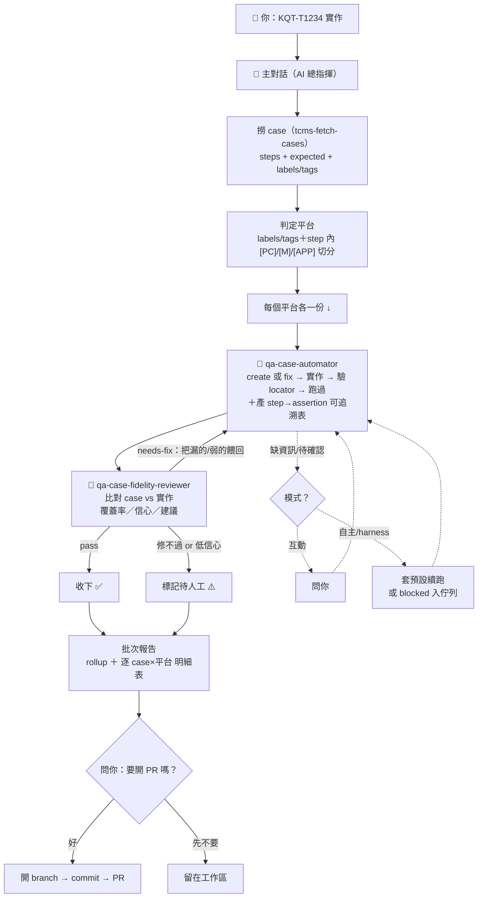

# 如何把 TCMS case 自動化

一句話：**跟 Claude 說要自動化哪些 case，它就會做完給你，最後問你要不要開 PR。**

你不用記指令、不用自己開瀏覽器、不用管它怎麼跑。用講的就好。

> **這是一條 AI Agent 流程**：你對話的**主對話 Claude 是 AI 總指揮**，它會派兩種 🤖 AI Agent 去做事——`qa-case-automator`（實作）與 `qa-case-fidelity-reviewer`（檢查實作有沒有忠實對到 case）。全程有 AI 在跑，你負責出需求 + 最後決定要不要開 PR。

---

## 怎麼用（直接把這些話貼給 Claude）

**單一 case**
```
KQT-T1234 實作
```

**一批 case**
```
把 KQT-T1234、KQT-T5678 做成自動化
```

**整個 Run**
```
Run 95 的 case 全部自動化
```
```
Run 95 裡 Eden 的 case 自動化
```

**做完想追問**
```
為什麼 KQT-T5678 是 flag-for-human？
```

你全程只需要在**最後回答一件事：要不要開 PR**（過程中若有平台/缺資訊要確認，Claude 也會問你，見下）。

---

## 流程圖（「KQT-T1234 實作」實際會跑的）



重點：**「跑得起來」不等於「過」**。每個 case 實作完會經 `qa-case-fidelity-reviewer` 檢查有沒有忠實覆蓋 case（每個 expected 有沒有真的被斷言）；不夠 → **自動丟回去修再檢查**（最多幾輪），還不行才標「待人工」。

### 元件各是什麼

> **型別**：🤖 **Agent** 會獨立跑一連串工作（subagent）；📄 **Skill** 是「怎麼做」的規範，被 Agent/主對話載來用。這流程有**兩個 Agent**：`qa-case-automator`、`qa-case-fidelity-reviewer`。

| 元件 | 型別 | 說明 |
| --- | --- | --- |
| **主對話 Claude** | 總指揮 | 你直接對話的那個。撈 case、判平台、跑「實作→檢查→重修」閉環、彙整報告、問你開不開 PR。**只有它能開 PR、也只有它會問你。** |
| **`qa-case-automator`** | 🤖 Agent | 一個平台一份，實作(create)或修現有(fix)+跑過+產可追溯表。不撈整批、不開 PR、不叫別的 agent。 |
| **`qa-case-fidelity-reviewer`** | 🤖 Agent | 對抗式檢查：比對 case 規格 vs 實作，出覆蓋率/信心/建議。唯讀，只評不改。 |
| `tcms-fetch-cases` | 📄 Skill | 撈 case steps + `labels`/`tags`（平台資訊）。 |
| `qa-automation-writer` | 📄 Skill | 寫 code + 驗 locator + 產可追溯表的規範。 |
| `qa-test-runner` | 📄 Skill | 跑測試 + 失敗診斷/修復。 |
| **Playwright MCP** | 工具 | 驗 locator 的真實瀏覽器；**單一共用，不能多案同開**；驗 mweb 要用手機 device profile。 |
| **kkday-QA-automation** | 本機 repo | 測試碼落地處（page object / test step / case yaml）。 |

---

## 「過」是什麼意思

一個 case 算「過」= **跑得起來 + 覆蓋 case 規格（每個 expected 都有真斷言）+ 忠實度 reviewer 認可**。只有測試變綠、但沒真的驗到 case 要驗的東西，**不算過**——這正是為了在沒有人工 reviewer 時，也能相信產出跟你寫的 case 一致。

---

## 一次做多平台

case 的 `labels`/`tags` 會標它適用哪些平台（如 `FE (Web/mWeb/Android/iOS)`）。Claude 會**依此對每個平台各寫一份**，同一 case 內若有 `[iOS]`/`[Android]`/`[PC]` 不同步驟也會分開處理。**多平台（尤其含 App）Claude 會先問你這輪要做哪些**（可能只先做 web/mweb、App 之後再說）。

## 想加速一批

可以叫 Claude「平行處理」，但**驗 locator 那步沒辦法平行**（Playwright MCP 單一共用瀏覽器）。所以做法是「驗證集中、其餘平行」：整批要驗的 locator 一次驗完，「寫 code + 跑測試」再分開平行。整批時間會降，但不會線性下降——工具限制，不是偷懶。

## 你可能會遇到的狀況

- **中途問你**：多平台要做哪些、`web/API` 混用要做哪個、缺商品 oid → 互動模式會問你；自主/harness 模式則套預設續跑、卡住的排入待人工佇列（不會停著等）。
- **忠實度不夠會自己重修**：reviewer 說覆蓋不足，Claude 會把漏的餵回去重寫再檢查，不是評完就算。
- **標「待人工」**：修幾輪還不過、或信心低，會標記出來給你，不硬過。
- **產品真的有 bug**：修現有 case 時若發現是產品壞（不是測試壞），**不會為了變綠改斷言**，會當產品 bug 回報。
- **最後問你要不要開 PR**：一定要你點頭才動 git。

## 常見坑

- **MCP Playwright 不能平行**：驗 locator 集中在主對話做。
- **mweb 要用手機 device profile**：kkday 看 User-Agent 判 web/mweb，只縮 viewport 會開到 web 頁。
- **只信「綠」不夠**：所以才有 fidelity reviewer；沒它把關的綠不算過。

## 想知道更多

- 主對話完整劇本（閉環/報告/模式）：`prompts/automate-tcms-cases.md`
- 各 Agent 權威定義：`agents/qa-case-automator.md`、`agents/qa-case-fidelity-reviewer.md`
